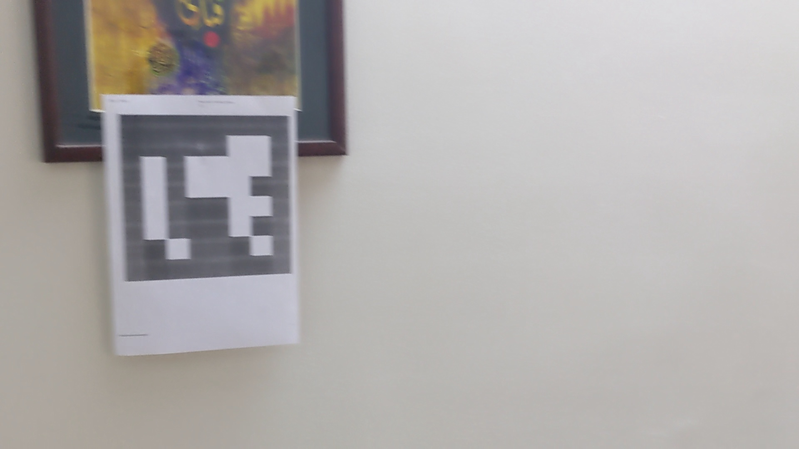
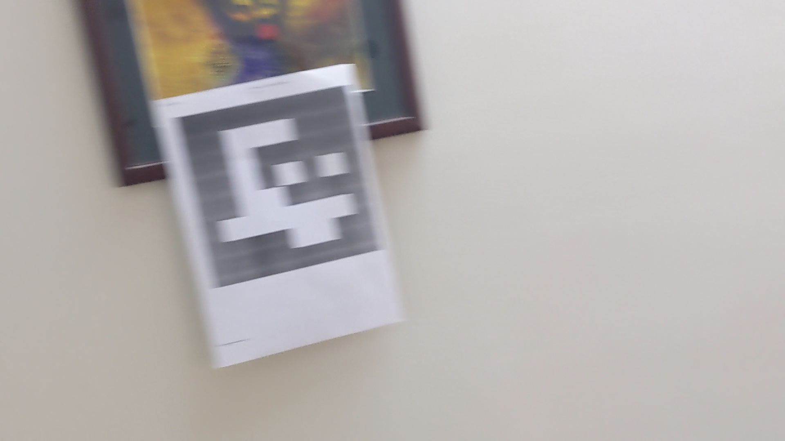
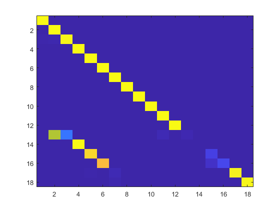

# 🔁 Adversarial attack on FAB-MAP using ArUco Markers

This project demonstrates a successful spoofing of the [original FAB-MAP](https://www.robots.ox.ac.uk/~mobile/FABMAP/) loop closure algorithm by injecting visually similar artificial landmarks (ArUco markers) to prevent loop closure. 

By manipulating visual input, we tricked FAB-MAP into believing that the same locations were different — a critical failure case in SLAM systems.

## 📌 Objective

To evaluate the robustness of FAB-MAP against synthetic landmarks and explore its vulnerabilities in visually ambiguous environments.

---

## 🧪 Setup

- **SLAM Backend:** Original FAB-MAP implementation (OpenFABMAP)
- **Spoofing Tool:** ArUco markers from OpenCV
- **Dataset:** Custom video feed or image sequence
- **Output Analysis Tool:** MATLAB (for matrix inspection)

---

## 🚨 Spoofing the Loop Closure

By swapping ArUco markers in different, non-overlapping environments, we were able to:

- Prevent **loop closure**
- Prevent FAB-MAP to relocalize and merge topologically distinct locations

---

## 📷 False Positive Example

Below are two different input frames where the loop closure was not detected:

### 🔹 Image A (Original Location)

### 🔹 Image B (Original Location with different ArUco Marker)

Despite being the same place, FAB-MAP incorrectly identified these as the different locations and did not close the loop. 

---

## 📊 MATLAB Output Matrix

Here is the portion of the FAB-MAP likelihood matrix showing the false loop closure:

📌 Note: The low likelihood between  images was induced due to visually different ArUco marker patterns.

## 🔁 How to Reproduce
Clone the original FAB-MAP and this repo

Insert ArUco markers into separate environments

Run the image sequence through FAB-MAP

Analyze the *.mat output or visualize loop closures

## ⚠️ Observations & Implications
FAB-MAP is vulnerable to visual spoofing via structured artificial landmarks

ArUco markers (being highly distinctive) are wrongly treated as environmental features

This can severely affect pose graph optimization and global consistency

## 🧠 Future Work
Integrate semantic or geometric checks before accepting loop closures

Augment FAB-MAP with a second validation layer (e.g., depth, spatial layout)

## 📜 License
This project is released under the MIT License.

## 🙋‍♂️ Author
Muhammad Ali — [(https://github.com/M-A-S1)]

